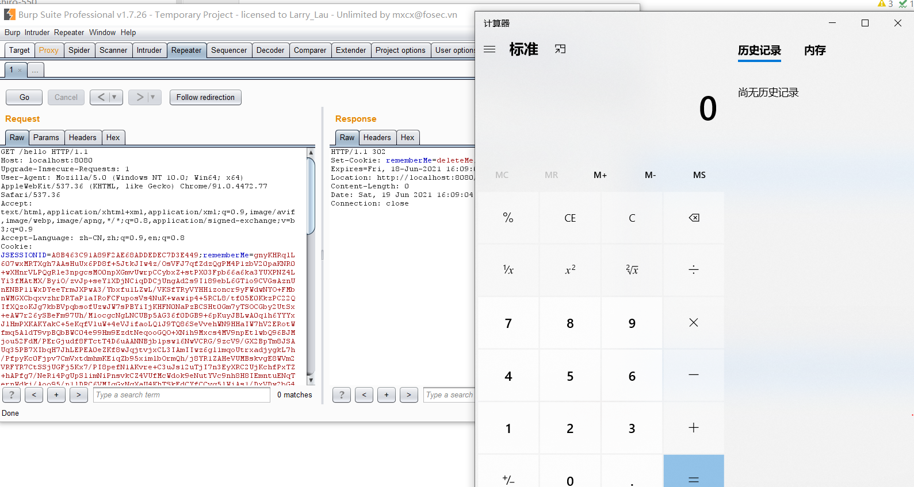

# Apache Shiro 小于1.2.4反序列化漏洞(CVE-2016-4437)(Shiro-550)

### 漏洞描述

Apache Shiro默认使用了`CookieRememberMeManager`，其处理cookie的流程是：得到rememberMe的cookie值 》 Base64解码 》 AES解密 》 反序列化。因AES密钥为硬编码，导致攻击者可以构造恶意数据造成反序列化的RCE漏洞。

### 漏洞复现

使用ysoserial生成CommonsBeanutils1的Gadget：

```bash
java -jar ysoserial-master-30099844c6-1.jar CommonsBeanutils1 "calc.exe" > poc.ser
```

运行`GenPayload.java`生成加密后的Payload，放入Cookie中的rememberMe字段发送即可：



### 参考链接

* [shiro550反序列化分析](https://www.cnblogs.com/twosmi1e/p/14279403.html)

* [Apache Shiro 1.2.4反序列化漏洞（CVE-2016-4437）](https://vulhub.org/#/environments/shiro/CVE-2016-4437/)