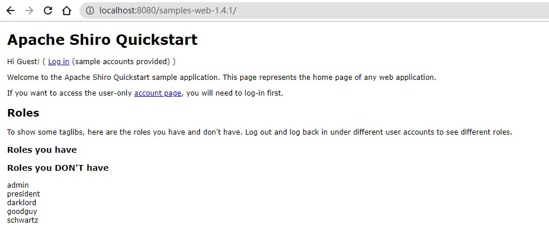

# Shiro-721 RememberMe Padding Oracle 漏洞(CVE-2019-12422)

### 漏洞描述

Shiro使用了AES-128-CBC模式对cookie进行加密，该模式易受到[`Padding Oracle`攻击](https://paper.seebug.org/1123/)。

Shiro处理cookie的流程：得到rememberMe的cookie值 》 Base64解码 》 AES解密 》 反序列化。

所以`padding oracle`攻击方式是，在不需要知道AES密钥且初始化向量IV可控（在rememberMe字段中）的前提下，尝试通过不同IV构造特定的序列化数据，以通过服务器端的==字符填充检查==，从而继续后面的反序列化操作。

### 漏洞复现

#### 环境启动

将target目录下编译完成的 samples-web-1.4.1.war 包拷贝到 Tomcat 的 webapps 目录下，启动tomcat即可。

#### 复现参考：[Shiro-721 RCE Via Padding Oracle Attack](https://github.com/inspiringz/Shiro-721)

### 参考链接

* [Shiro-721 RCE Via Padding Oracle Attack](https://github.com/inspiringz/Shiro-721)
* [Shiro RCE again（Padding Oracle Attack）](https://www.anquanke.com/post/id/192819)
* [CVE-2019-12422 Shiro721 ( Apache Shiro RememberMe Padding Oracle 1.4.1 反序列化漏洞) 分析 下 ](https://www.guildhab.top/2020/12/cve-2019-12422-shiro721-apache-shiro-rememberme-padding-oracle-1-4-1-反序列化漏洞-分析-下/)