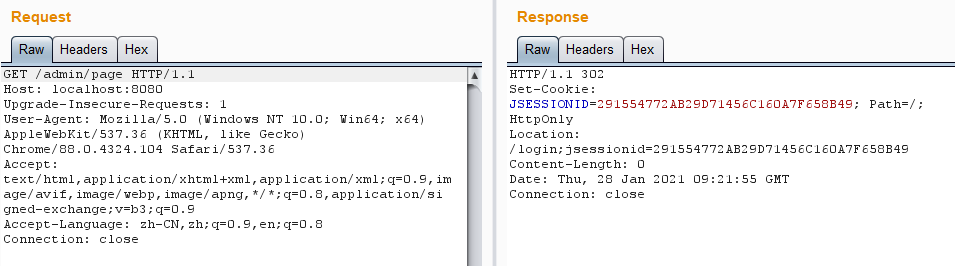
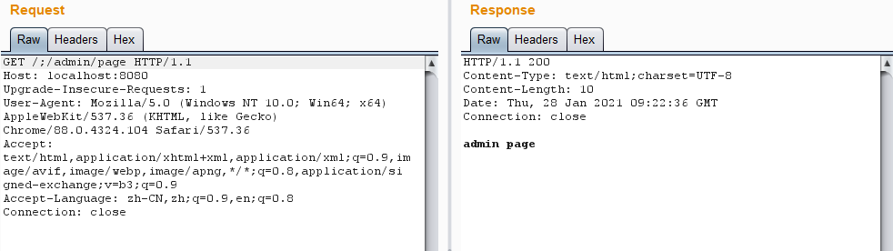

# Shiro 权限绕过漏洞（CVE-2020-11989）

### 漏洞描述

当Shiro和 Spring 结合使用时，在一定权限匹配规则下，攻击者可通过构造特殊的 HTTP 请求包完成身份认证绕过。

影响范围：

* Shiro < 1.5.3

### 漏洞复现

环境

| Shiro Version | Shiro 1.5.1            |
| :------------ | :--------------------- |
| Web Server    | Tomcat 8.5.53          |
| IDE           | IDEA 2020.1.1 ULTIMATE |

漏洞成功利用存在下面两个条件：

1. 若Shiro版本大于1.5.1，需要应用不能部署在根目录，如`/test`目录下（原因见参考链接1）。
2. Spring控制器中没有另外的权限校验代码

访问`/admin/page`接口，可以看到被`authc`拦截器拦截了，将会跳转到登录接口进行登录。

访问`/;/admin/page`，成功绕过`authc`拦截器，获取到了资源。

### 参考链接

* [Apache Shiro权限绕过漏洞分析(CVE-2020-11989)](https://xz.aliyun.com/t/7964)