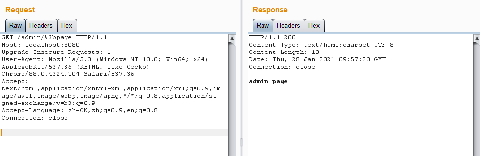

# Shiro 权限绕过漏洞（CVE-2020-13933）

### 漏洞描述

Apache Shiro 的 CVE-2020-11989 修补补丁依旧存在缺陷，由于shiro和spring在处理url中仍然存在差别，通过构造特殊的HTTP请求，可以再次绕过授权，访问未授权的信息。

影响范围：

* Shiro < 1.6.0

- Spring 框架中只使用 Shiro 鉴权

### 漏洞复现

访问`/admin/page`接口，可以看到被`authc`拦截器拦截了，将会跳转到登录接口进行登录。

访问`/admin/%3bpage`，成功绕过`authc`拦截器，获取到了资源。

### 参考链接

* [Apache shiro安全漏洞(CVE-2020-13933)分析](https://xz.aliyun.com/t/8230)