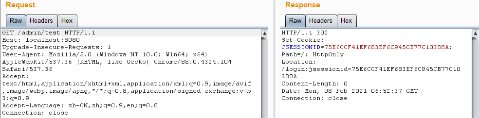
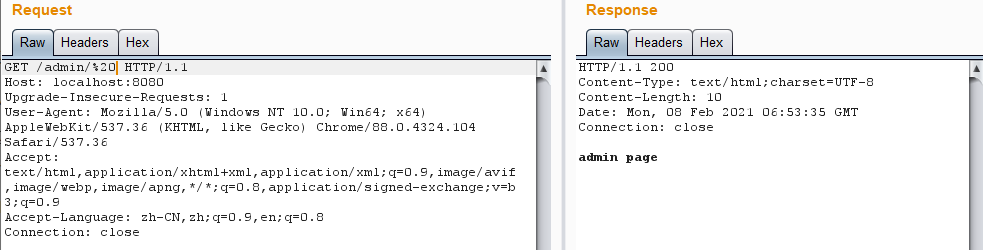
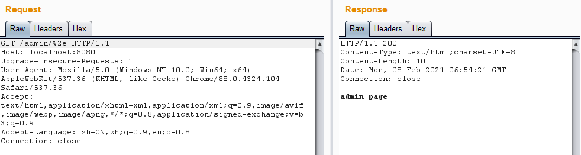

# Shiro 权限绕过漏洞（CVE-2020-17523）

### 漏洞描述

当Shiro和 Spring 结合使用时，在一定权限匹配规则下，攻击者可通过构造特殊的 HTTP 请求包完成身份认证绕过。

具体绕过原因有两个：

1. tokenizeToStringArray函数没有正确处理空格。
2. 处理最后一个/的逻辑，不应在循环匹配路径的逻辑之前。

影响范围：

* Shiro < 1.7.1

### 漏洞复现

环境

| Shiro Version | Shiro 1.5.1            |
| :------------ | :--------------------- |
| Web Server    | Tomcat 8.5.53          |
| IDE           | IDEA 2020.1.1 ULTIMATE |

请求`/admin/test` 302跳转至login:

绕过姿势一：`/admin/%20`

绕过姿势二：`/admin/%2e`

### 参考链接

* [Shiro 权限绕过漏洞（CVE-2020-11989）](https://github.com/xhycccc/Shiro-Vuln-Demo/tree/main/shiro_cve-2020-11989)