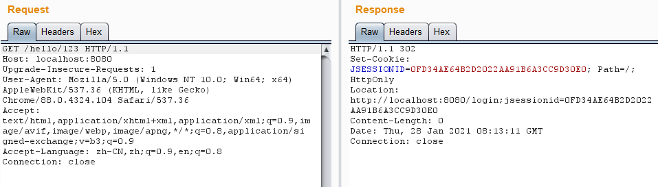
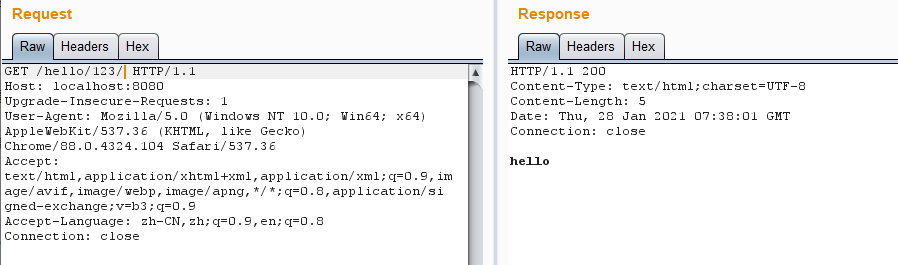

# Shiro 权限绕过漏洞（CVE-2020-1957）

### 漏洞描述

当Shiro和 Spring 结合使用时，在一定权限匹配规则下，攻击者可通过构造特殊的 HTTP 请求包完成身份认证绕过。

影响版本：Shiro < 1.5.2

### 漏洞复现

访问`/hello/123`接口，可以看到被`authc`拦截器拦截了，将会跳转到登录接口进行登录。

访问`/hello/123/`，成功绕过`authc`拦截器，获取到了资源。

### 参考链接

* [Shiro 权限绕过漏洞（CVE-2020-1957）复现](https://blog.csdn.net/xuandao_ahfengren/article/details/108218864)
* [CVE-2020-1957 shiro权限绕过漏洞分析](https://blog.csdn.net/qq_22807425/article/details/108283839)
* [Shiro 权限绕过漏洞分析（CVE-2020-1957）](https://blog.riskivy.com/shiro-%E6%9D%83%E9%99%90%E7%BB%95%E8%BF%87%E6%BC%8F%E6%B4%9E%E5%88%86%E6%9E%90%EF%BC%88cve-2020-1957%EF%BC%89/)